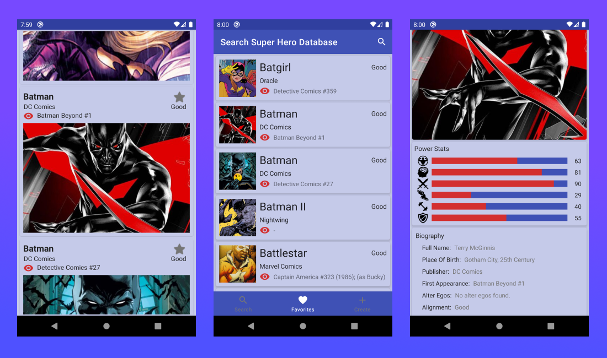

<h1 align="center">Super Hero Database</h1>

<p align="center">
Super Hero Database is a sample Android project using the <a href="https://www.superheroapi.com/">Super Hero</a> API based on MVVM architecture. It showcases the app development with well-designed architecture and up-to-date Android tech stacks.



</p>

## Features
* 100% Kotlin
* MVVM architecture
* Android architecture components and Jetpack
* Single activity
* Dependency injection
* Testing (Upcoming)


## Tech Stacks
* [Retrofit](http://square.github.io/retrofit/) + [OkHttp](http://square.github.io/okhttp/) - RESTful API and networking client.
* [Koin](https://insert-koin.io/) - Dependency injection.
* [Android Architecture Components](https://developer.android.com/topic/libraries/architecture) - A collections of libraries that help you design rebust, testable and maintainable apps.
    * [Room](https://developer.android.com/training/data-storage/room) - Local persistence database.
    * [ViewModel](https://developer.android.com/reference/androidx/lifecycle/ViewModel) - UI related data holder, lifecycle aware.
    * [LiveData](https://developer.android.com/topic/libraries/architecture/livedata) - Observable data holder that notify views when underlying data changes.
    * [Data Binding](https://developer.android.com/topic/libraries/data-binding) - Declarative way to bind data to UI layout.
    * [Navigation component](https://developer.android.com/guide/navigation) - Fragment routing handler.
* [Groupie](https://github.com/lisawray/groupie) - Simplified way to build complex layout in RecyclerView.
* [Glide](https://github.com/bumptech/glide) - Image loading.
* [Coroutines](https://developer.android.com/kotlin/coroutines) - Light-weight threads for background operations. (Upcoming)

## Architecture


Followed Google recommended [Guide to app architecture](https://developer.android.com/jetpack/guide) to structure the architecture based on MVVM and reactive UI using LiveData observables.

* **View**: Activity/Fragment with UI-specific logic only.
* **ViewModel**: It keeps the logic away from View layer, provides data streams for UI and handle user interactions.
* **Model**: Repository pattern, data layers that provide interface to manipulate data from both the local and remote data sources. The local data sources will serve as [single source of truth](https://en.wikipedia.org/wiki/Single_source_of_truth).

## Package Structures

```
com.mlm09kdev.superHeroDB # Root Package
├── di                    # Dependency injection modules
├── model               
│   ├── database          # Local persistence database
|   │   ├── dao           # Data Access Object for Room
|   |   ├── entity        # Model classes
│   ├── network           # Remote data source
│   └── repo              # Repositories for single source of data
│
├── ui                    # Fragment / View layer
│   ├── adapters          # recyclerView Adepter
│   ├── superhero        
|   │   ├── create        # create screen Fragment, ViewModel, and viewModel Factory
|   │   ├── details       # details screen Fragment, ViewModel, and viewModel Factory
|   │   ├── favorites     # favorites screen Fragment, ViewModel, and viewModel Factory
|   │   ├── search        # search screen Fragment, ViewModel, and viewModel Factory
│   ├── MainActivity      # Single activity
|   └── ScopedFragment    # based Fragment that has CoroutineScope Functions
|       
└── utils                 # Utility Classes / Kotlin extensions


```

## API Key 🔑
You will need to provide developer key to fetch the data from <a href="https://www.superheroapi.com/">Super Hero</a> API.
* Generate a new key from [here](https://www.superheroapi.com/). Copy the key and go back to Android project.
* Define a variable `api_token` in gradle.properties with the double quotes, it looks like

```kotlin
api_token="5**************2"
```

```kotlin
 buildTypes.each {
        it.buildConfigField 'String', 'API_TOKEN', api_token
    }
```
* Perform gradle sync.

## LICENSE

```
Copyright (c) 2020 Engine Bai

Permission is hereby granted, free of charge, to any person obtaining a copy
of this software and associated documentation files (the "Software"), to deal
in the Software without restriction, including without limitation the rights
to use, copy, modify, merge, publish, distribute, sublicense, and/or sell
copies of the Software, and to permit persons to whom the Software is
furnished to do so, subject to the following conditions:

The above copyright notice and this permission notice shall be included in all
copies or substantial portions of the Software.

THE SOFTWARE IS PROVIDED "AS IS", WITHOUT WARRANTY OF ANY KIND, EXPRESS OR
IMPLIED, INCLUDING BUT NOT LIMITED TO THE WARRANTIES OF MERCHANTABILITY,
FITNESS FOR A PARTICULAR PURPOSE AND NONINFRINGEMENT. IN NO EVENT SHALL THE
AUTHORS OR COPYRIGHT HOLDERS BE LIABLE FOR ANY CLAIM, DAMAGES OR OTHER
LIABILITY, WHETHER IN AN ACTION OF CONTRACT, TORT OR OTHERWISE, ARISING FROM,
OUT OF OR IN CONNECTION WITH THE SOFTWARE OR THE USE OR OTHER DEALINGS IN THE
SOFTWARE.
```

